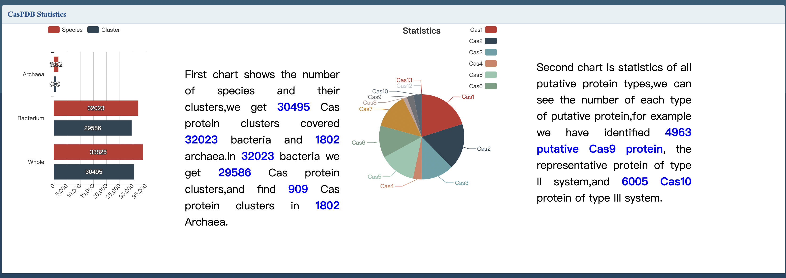

# CasPDB:an integrated and annotated database for Cas proteins from bacteria and archaea

- Paper : [CasPDB:an integrated and annotated database for Cas proteins from bacteria and archaea](https://academic.oup.com/database/article/doi/10.1093/database/baz093/5549733?login=false)
- The new link of CasPDB database  is http://i.uestc.edu.cn/CASPDB/
 

